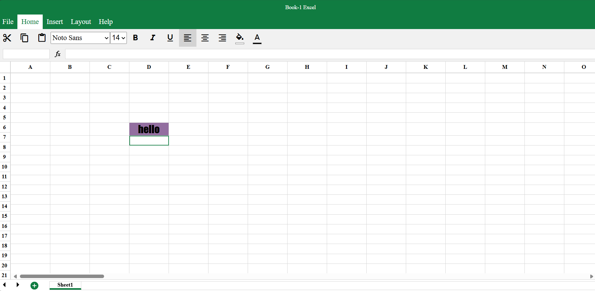

# Excel Clone

🔗 **Live Demo:** [Click here to view the project](https://parthjuneja24.github.io/excel-clone/)

---

## Description:

Excel Clone is built using the **Electron framework**, with technologies like **HTML**, **CSS**, **JavaScript**, **jQuery**, and **EJS** as a templating engine.

---

## 🔧 Features:

- 🧮 Formula evaluation
- 🔁 Cycle detection in formulas
- 💾 Open/Save file functionality
- 🎨 Cell formatting (bold, italic, alignment)
- 📄 Multiple sheet support *(if implemented)*

---

## 📸 Screenshot:



---
## 📦 Tech Stack:

- Electron
- HTML, CSS, JavaScript
- jQuery
- EJS (Embedded JavaScript templates)

---

## 🚀 Getting Started:

```bash
git clone https://github.com/Parthjuneja24/excel-clone.git
cd excel-clone
npm install
npm start
